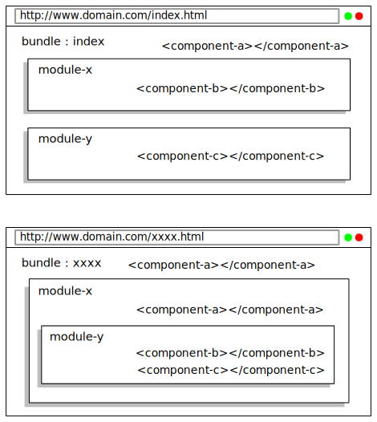

# NMICRO-CLIENT — présentation

## Principe

1. nmicro-client ➔ packager/framwork HTML, CSS, JS + medias
1. génération de plusieurs modèles (CSS [via SASS] + medias)
1. multi-langues
1. deux types de sortie (structure des dossiers):
	1. app ➔ application mobile
	1. web ➔ site web

## Fonctions

1. server HTTP
1. server REST pour des tests d'API
1. builder
1. auto-packing à l'enregistrement d'un fichier source
	1. erreur de construction dans la console
	1. socket.io:
		1. auto reload
		1. log/error du navigateur dans la console

## Architecture, modularisation

### bundle, module, component

- **+ API**
- **+ pages simples**

### Structure du dossier **sources**

## Niveau 0
- **sources**
	- **apis**
	- **bundles**
	- **components**
	- **lib**
	- **models**
	- **modules**
	- **rest**
	- **setting.js**
- **nmicro-client.js** ➔ configuration pour nmicro-client

## apis

- **apis** ➔ dossier pour les modules **apis**
	- **web** ➔ dossier du module *web*  (obligatoire)
		- **locale** ➔ dossier des langues
			- **en.json** ➔ ressource langue en du module *web*
			- **fr.json** ➔ ressource langue fr du module *web*
		- **web.js** ➔ ressource JS du module *web*  (obligatoire)

## bundles

- **bundles** ➔ dossier pour les bundles
	- **home** ➔ dossier du bundle *home*  (obligatoire)
		- **locale** ➔ dossier des langues
			- **en.json** ➔ ressource langue en du bundle *home*
			- **fr.json** ➔ ressource langue fr du bundle *home*
		- **home.js** ➔ ressource JS du bundle *home*  (obligatoire)
		- **home.scss** ➔ ressource SCSS du bundle *home*
		- **home.tpl** ➔ ressource template du bundle *home*  (obligatoire)

## components

- **components** ➔ dossier pour les components
	- **line** ➔ dossier du component *line*  (obligatoire)
		- **locale** ➔ dossier des langues
			- **en.json** ➔ ressource langue en du component *line*
			- **fr.json** ➔ ressource langue fr du component *line*
		- **line.js** ➔ ressource JS du component *line*  (obligatoire)
		- **line.scss** ➔ ressource SCSS du component *line*
		- **line.tpl** ➔ ressource template du component *line*

## lib

- **lib** ➔ dossier pour les lib
	- **util.js** -> ressource JS (scop window)
	- **timer.js** -> ressource JS (scop window)

## models

- **models** ➔ dossier pour les modèles
	- **default** ➔ dossier du modèle *default*  (obligatoire)
		- **medias** ➔ dossier des medias
			- **favicon.png** ➔ ressource image
			- **font.ttf** ➔ ressource fonte
		- **main.scss** ➔ ressource SCSS de base du modèle *default* (obligatoire)
		- **vars.scss** ➔ ressource SCSS des variables du modèle *default* (obligatoire)

## modules

- **modules** ➔ dossier pour les modules
	- **user** ➔ dossier du module *user*
		- **locale** ➔ dossier des langues
			- **en.json** ➔ ressource langue en du module *user*
			- **fr.json** ➔ ressource langue fr du module *user*
		- **user.js** ➔ ressource JS du module *user*  (obligatoire)
		- **user.scss** ➔ ressource SCSS du module *user*
		- **user.tpl** ➔ ressource template du module *user*

## pages

- **pages** ➔ dossier pour les pages simple
	- **doc** ➔ dossier de la page *doc*  (obligatoire)
		- **locale** ➔ dossier des langues
			- **en.json** ➔ ressource langue en de la page *doc*
			- **fr.json** ➔ ressource langue fr de la page *doc*
		- **doc.scss** ➔ ressource SCSS de la page *doc*
		- **doc.tpl** ➔ ressource template de la page *doc*  (obligatoire)

## rest

- **rest** ➔ dossier pour le serveur REST (tests)
	- **web-rest.js** ➔ ressource JS pour le serveur REST
